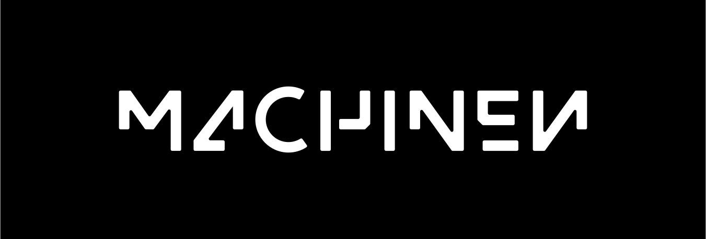

<p align="center">
  
</p>

<h1 align="center">M A C H I N E N</h1>

Hand off a running Linux VM between hosts. Freeze it on your laptop, thaw it
on a server, resume it next week. The program picks up exactly where it left
off — like waking a laptop from sleep, except on a different computer.

A native arm64 microVM runtime under the hood. Node.js is the first-class
target; Python, bash, and anything else that boots in a Linux VM works too.

> **Note:** the source code isn't published yet — it'll be available here soon.

## Install

```bash
npm i @machinen/cli @machinen/runtime
```

Then run the CLI with `npx machinen …` (or the shorter `npx mn …` — both
names install). Prefer it on your PATH? `npm i -g @machinen/cli` is fine
too.

The right VMM binary is pulled automatically via optional dependencies
(`@machinen/vmm-arm64-darwin` on Apple Silicon Macs, `@machinen/vmm-arm64-linux`
on arm64 Linux). No system dependencies.

First run fetches the kernel + rootfs from a Github release on the
companion repo over plain HTTPS — no auth required.

## Quickstart

Bake an image, boot it, accumulate some state, then move the running process
to another host.

### 1. Bake

A tiny HTTP server that counts hits in memory:

```js
// counter.mjs
import { createServer } from "node:http";
let count = 0;
createServer((_, res) => {
  res.end(JSON.stringify({ count: ++count }) + "\n");
}).listen(3000);
```

Bake it into a rootfs tarball with `provision()`:

```ts
// bake.ts
import { readFileSync } from "node:fs";
import { provision } from "@machinen/runtime";

await provision({
  install: async (vm) => {
    await vm.exec("apt-get update && apt-get install -y nodejs");
    await vm.writeFile("/opt/counter.mjs", readFileSync("./counter.mjs"));
  },
  cmd: ["/usr/bin/node", "/opt/counter.mjs"],
  out: "./counter.tar.gz",
});
```

```bash
node bake.ts
```

### 2. Boot

```bash
npx machinen boot --name counter -p 3000:3000 --detached ./counter.tar.gz
curl localhost:3000                        # { count: 1 }
curl localhost:3000                        # { count: 2 }
```

The process is now sitting on host A with `count = 2` in its heap.

### 3. Handoff

Freeze it, copy the bundle to host B, thaw it:

```bash
npx machinen snapshot counter ./counter.snap
scp ./counter.tar.gz ./counter.snap host-b:
ssh host-b npx machinen restore ./counter.snap -p 3000:3000 &
curl host-b:3000                           # { count: 3 }  ← same process
```

Same arch only (arm64 ↔ arm64). Memory, file descriptors, and timers come
back exactly as they were.

The bundle remembers the absolute path of the rootfs tarball you booted
from. On the same host that's all you need — `restore` reuses the same
tarball so CRIU can re-open file-backed VMAs (executable, shared
libraries) at the paths they were dumped from. Across hosts, copy the
tarball to the same path or pass `--image <tarball>` to override.

## Fork

`fork` is snapshot + restore without killing the source. The original keeps
running; you get a sibling VM with the same heap, same open files, and a
copy-on-write disk. Both processes diverge from the same instant.

Pick up from Step 2 above — `counter` is running with `count = 2`:

```bash
npx machinen fork counter --new-name counter-b --detach

npx machinen exec counter   -- curl -s localhost:3000   # { count: 3 }
npx machinen exec counter-b -- curl -s localhost:3000   # { count: 3 }
npx machinen exec counter-b -- curl -s localhost:3000   # { count: 4 }
npx machinen exec counter   -- curl -s localhost:3000   # { count: 4 }
```

Both VMs branched from the same `count = 2` heap and now count
independently. Use it to clone a warmed-up process: a database with caches
loaded, a test fixture in exactly the right state, a long-running compute
job branched into N parallel explorations.

The fork doesn't inherit the source's `-p` host forwards — host ports are
global, only one process can bind each one. Two ways to reach a fork:

```bash
# A) exec over vsock — works for any guest port, no host forward needed.
npx machinen exec counter-b -- curl -s localhost:3000

# B) -p with non-conflicting host ports — forwards on the host.
npx machinen fork counter --new-name counter-b -p 3001:3000 --detach
curl localhost:3001                                            # the fork
curl localhost:3000                                            # still the source
```

Pass `-p` multiple times for multiple ports. If you pick a host port the
source is already forwarding, `fork` errors with
`BOOT_PORT_FORWARD_IN_USE` and names the VM that's holding it.

From Node, same shape:

```ts
const fork = await vm.fork({ name: "counter-b" });
```

## From Node

Same arc, driven from TypeScript:

```ts
import { readFileSync } from "node:fs";
import { boot, provision, restore } from "@machinen/runtime";

await provision({
  install: async (vm) => {
    await vm.exec("apt-get install -y nodejs");
    await vm.writeFile("/opt/counter.mjs", readFileSync("./counter.mjs"));
  },
  cmd: ["/usr/bin/node", "/opt/counter.mjs"],
  out: "./counter.tar.gz",
});

const vm = await boot({ image: "./counter.tar.gz", name: "counter" });
// ... let it run, serve traffic, accumulate state ...

await vm.snapshot({ outDir: "./counter.snap" });

// elsewhere (possibly on another host):
const restored = await restore({ snapDir: "./counter.snap" });
```

## Documentation

- [Quickstart](./docs/quickstart.md) — the same three-step walkthrough
  with more colour
- [Guides](./docs/) — recipes for creating VMs, snapshots and forks,
  mounts, and networking
- [`@machinen/cli` reference](./docs/api/cli.md) — every command
  and flag
- [`@machinen/runtime` reference](./docs/api/runtime.md) — every
  exported function, type, and error class (typedoc-generated)

Three runnable demos live in [`examples/`](./examples):

- [`quickstart`](./examples/quickstart) — the counter walkthrough above
  as a runnable repo.
- [`fork-pi`](./examples/fork-pi) — snapshot a VM with the `pi` coding
  agent installed, then fork three siblings that each answer a different
  prompt in parallel.
- [`live-mount`](./examples/live-mount) — host directory mounted into
  the guest over a FUSE-over-vsock channel; bidirectional, no rebuild
  on edit.

## Other ways to boot

```bash
npx machinen boot -- /bin/sh                    # ad-hoc: boot base + run a cmd
npx machinen boot ./my-image.tar.gz             # boot a provisioned rootfs tarball
npx machinen install                            # pre-fetch base assets (CI / airgap)
npx machinen install --version <tag>            # pin to a specific release tag
```

## License

[FSL-1.1-MIT](https://fsl.software/) — Functional Source License. Converts to MIT two
years after each release.
